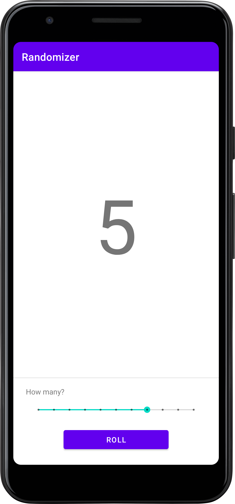

# Randomizer App

The Randomizer app is a simple Android application that allows users to generate random numbers within a specified range. It includes a button to trigger the randomization process and a seek bar to set the range of possible random numbers.

## Features

- Generate random numbers within a user-defined range.
- User-friendly interface with a button and seek bar for easy interaction.

## Getting Started

### Prerequisites

- Android Studio installed on your machine.

### Installation

1. Clone the repository:

    ```bash
    git clone https://github.com/Hardvan/Randomizer.git
    ```

2. Open the project in Android Studio.

3. Build and run the app on an Android emulator or device.

## Usage

1. Launch the app on your Android device.

2. Use the seek bar to set the range of possible random numbers.

3. Tap the "Roll" button to generate a random number within the specified range.

4. The result will be displayed on the screen.

## Screenshots


